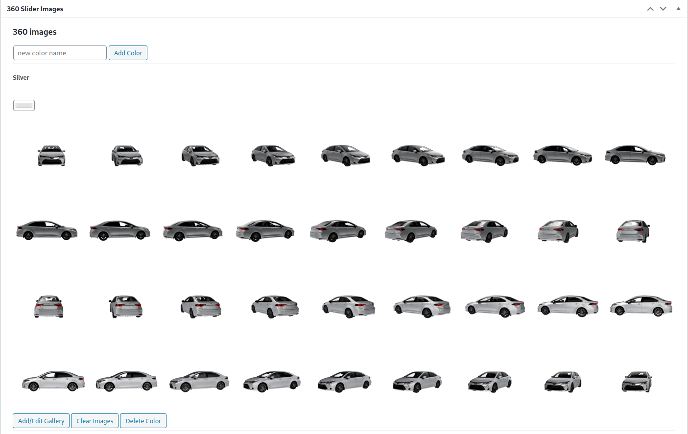
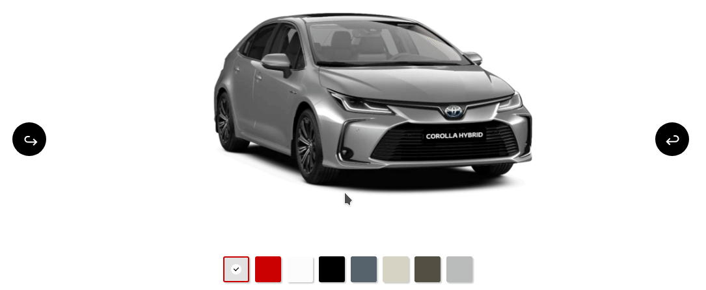

# wordpress-slider-with-color-templates

A wordpress plugin that adds a block while editing a post in the dashboard for you to upload images of the same object but in different colors, then provides an elementor widget (based on swiper js) that when placed inside the page of the post, automatically retrieves and displays those images and allows the user to select their required color.

## Plugin requirements:-
- display 360 images of a product
- display different colors of the same product
- work in a post layout and not part of woocommerce

This is a wordpress plugin i've created for a specific project (as such, there was no specific effort to make it highly configurable for differen't needs).

---
## Example Images

### Dashboard

### Slider
